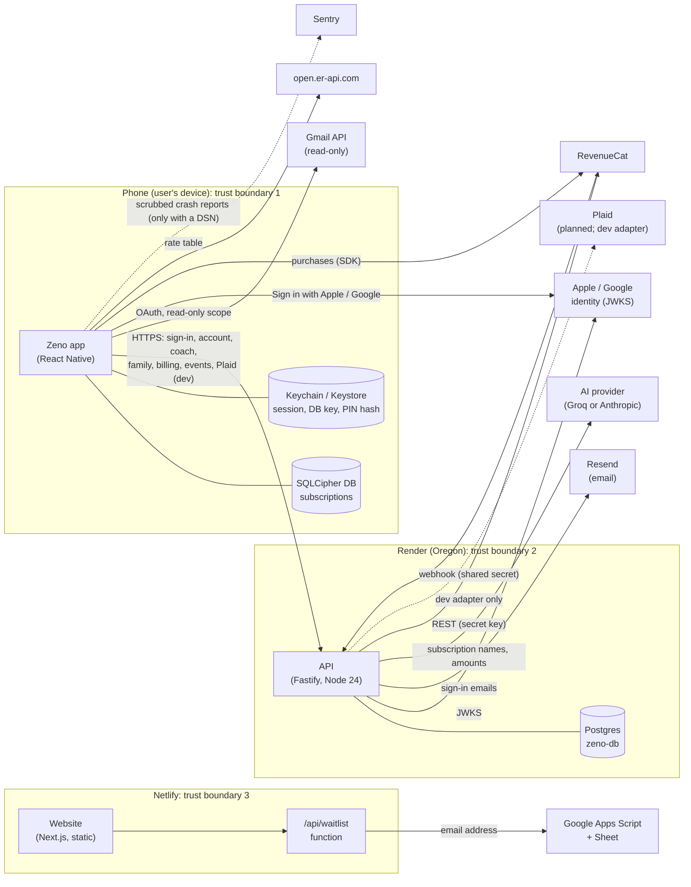

# Zeno threat model (P7.1, 2026-10-05)

What can go wrong, where, and what stops it, with the evidence for each answer. Method:
the components and data flows below were read in the code on 2026-10-05 (which endpoints
the app calls, which outside services each part talks to), not taken from older docs.
Every mitigation names its evidence: a test file, a CI job, or a config line. A threat
with no evidence says **open**, with who owns it. "Log" is `docs/HARDENING_LOG.md`, and
"F‹n›" is a finding row there.

## 1. The system and its trust boundaries

**What the app does NOT do** (read in `apps/mobile/src`, 2026-10-05): it never calls
`/sync/push` or `/sync/pull`, `/public-api/keys`, `/business/summary` or the
open-banking intents; the push token is kept in the keychain and never sent to the API
(`notificationService.ts`); email content goes from Google to the phone only, never to
our API (`emailScanner.ts`).

## 2. What is worth protecting

| Asset | Where it lives | Why it matters |
|---|---|---|
| The user's subscription list | the phone (SQLCipher) | money data; the product's core promise |
| Sign-in tokens: access (15 min), refresh (30 days), sign-in link and code | phone keychain; API memory + Postgres (hashed where stored) | whoever holds one acts as the user |
| Gmail OAuth token | phone keychain | read access to the user's inbox |
| Signing keys (JWT RS256), storage encryption key, webhook secret, provider keys | Render environment; owner's key files | forge sessions, read stored Plaid tokens, fake billing events |
| Household membership and spend totals | API + Postgres | shared between people who chose to share |
| Waitlist emails | Google Sheet | personal data held by us |
| The website's content | Netlify | public claims (truthfulness, SEO) |

## 3. STRIDE per surface

**S**poofing, **T**ampering, **R**epudiation, **I**nformation disclosure, **D**enial of
service, **E**levation of privilege.

### 3.1 The phone app

| | Threat | Mitigation | Evidence |
|---|---|---|---|
| S | Someone else uses an unlocked or borrowed phone | App lock (PIN, PBKDF2 600k, lockout after 10) engages on leaving the app | `apps/mobile/src/security/app-lock.test.ts`; `docs/MASVS_CHECKLIST.md` AUTH-2 (on a device) |
| S | A sign-in link sent by someone else signs the phone into their account | Links work only for a request made on this phone for the same email | `apps/mobile/src/auth/authStore.flows.test.ts` ("P3.5 (F100)") |
| S | Clock moved past the PIN lockout | **Open (F14, owner decision)**: each cycle wins one guess |  |
| T | Data changed on disk | SQLCipher; key in the keystore, device-bound | `docs/MASVS_CHECKLIST.md` STORAGE-1 (checked on a device) |
| I | Data read from disk or backups | SQLCipher; `allowBackup=false`; release strips console logs | `docs/MASVS_CHECKLIST.md` STORAGE-1, STORAGE-2 |
| I | Personal data in crash reports | Scrubbed before sending; inert without a DSN | `apps/mobile/src/monitoring/scrub-edges.test.ts`, `sentry-scrub.test.ts`, `redact.test.ts` (F213) |
| I | Widget snapshot in plaintext | **Open (F161, owner decision)**: app-private, not backed up |  |
| I | Lock screen captured or shown to accessibility services | `FLAG_SECURE` on lock and PIN screens; locked tree holds only the lock | `docs/MASVS_CHECKLIST.md` STORAGE-2 (F105) |
| D | A hostile CSV or email body hangs or crashes the reader | Parsers never throw; linear-time checks | `apps/mobile/src/properties.test.ts`; `packages/shared/src/properties.test.ts` |
| E | A failed sign-in leaves the app saying "signed in" | Every failure path asserts signed-out | `apps/mobile/src/auth/authStore.flows.test.ts` (F212) |

### 3.2 The API

| | Threat | Mitigation | Evidence |
|---|---|---|---|
| S | Forged or replayed access token | RS256 only, issuer, audience, expiry to the second, revocation on account deletion | `apps/api/src/routes/auth-expiry.test.ts`; `apps/api/src/auth-guard.test.ts`; `apps/api/src/token-path.test.ts` |
| S | A stolen Apple or Google token used for our sign-in | Signature against the provider's keys, issuer, audience, nonce bound to this sign-in (F10) | `apps/api/src/routes/auth-social.test.ts` |
| S | Sign-in code guessed | 6+ characters, attempts capped per address, per-IP limits | `apps/api/src/rate-limits.test.ts`; `apps/api/src/routes/auth.test.ts` |
| S | Fake billing event | Webhook shared secret; the payload is never trusted, only "re-check this user" (F85) | `apps/api/src/webhook.test.ts` |
| T | Sync data overwritten by an old or forged version | Highest version wins; values and counts bounded | `apps/api/src/sync.properties.test.ts`; `packages/shared/src/schemas.test.ts` (F205) |
| T | Prototype pollution through a body | Rejected at the parser on every body route | `apps/api/src/fuzz.test.ts` ("hostile shapes") |
| R | No record of who did what | Request ids on every response and log line; server errors alert a webhook. **Partial:** no audit trail of user actions | `apps/api/src/log-hygiene.test.ts`; `apps/api/src/app.routes.test.ts` |
| I | One user reads another's data | Every route's access pinned; households check membership | `apps/api/src/authz-matrix.test.ts` |
| I | Secrets or emails in logs | Log hygiene tested; addresses hashed or masked | `apps/api/src/log-hygiene.test.ts` |
| I | Stored Plaid tokens read from the database | AES-256-GCM with a 16-byte tag, key rotation without loss | `apps/api/src/storage/pg.test.ts`, `pg-gcm.test.ts` |
| D | Flooding a route | Per-route limits on top of a global one | `apps/api/src/rate-limits.test.ts`. **Partial:** limits are per instance; edge limiting is P8 |
| D | Email-bombing one inbox from many IPs | 5 sign-in emails per address per 15 minutes | `apps/api/src/routes/auth-scope.test.ts` (F209) |
| D | Making the API hammer Apple or Google | Key-list cache and a 30 s refetch cooldown (F83) | `apps/api/src/routes/auth-social.test.ts` ("JWKS handling") |
| E | Deleting one account signs everyone out | Revocation scoped to the account | `apps/api/src/routes/auth-scope.test.ts` (F208) |
| E | A logged-out access token keeps working | **Open (F77, owner decision)**: up to 15 minutes |  |

### 3.3 The database (Render Postgres)

| | Threat | Mitigation | Evidence |
|---|---|---|---|
| I | Traffic read in transit | TLS by default (`DATABASE_SSL`, "verify" when unreadable) | `apps/api/src/storage/pg.test.ts` (SSL modes); `apps/api/src/config.test.ts` |
| T | Code injected through queries | Parameterised queries only | `apps/api/src/storage/real-pg.test.ts` (against real Postgres) |
| D | Data lost (the free database expires 2026-11-03; no restore drill) | **Open (P8, owner)** |  |

### 3.4 The website

| | Threat | Mitigation | Evidence |
|---|---|---|---|
| T | Injected script | CSP without `'unsafe-inline'` scripts (per-page hashes); `'unsafe-inline'` styles accepted until 2027-03-31 | `apps/web/e2e/every-route.spec.ts`; `scripts/zap-gate.mjs` (nightly DAST) |
| I | A secret in the built site | Canary build: every non-public env name set and searched for in `.next` | `scripts/build-secret-scan.mjs` (CI) |
| D | Waitlist flooded | **Partial:** the function validates the address; no rate limit of our own (Netlify's platform limits only) | `apps/web/app/api/waitlist/route.test.ts` |
| S | A false claim on a public page | Copy rules tested (banned claims, prices equal the bill) | `apps/web/app/landings.test.tsx`; `apps/web/app/seo.test.tsx`; `apps/web/app/truthfulness.test.tsx` |

### 3.5 Outside services

| Service | What it receives | Threat | Mitigation / status |
|---|---|---|---|
| AI provider | subscription names, categories, amounts, the user's question | prompt injection; data shared | user data fenced as data; fallback charter pinned (`apps/api/src/coach.fallback.test.ts`); the privacy policy names it |
| Resend | the user's email address and a sign-in link | link intercepted in transit | HTTPS links only in production (`apps/api/src/config.test.ts`) |
| RevenueCat | app user id (account id), purchases | spoofed webhook | shared secret; re-verify, never trust (`apps/api/src/webhook.test.ts`) |
| Sentry | scrubbed error events | personal data leak | scrubbers tested (F213); inert without a DSN |
| Gmail | OAuth from the phone | over-broad access | `gmail.readonly` scope only (`emailScanner.ts`); **F11 open** (Google's redirect rules, owner: client ids) |
| Google Sheet | waitlist emails | rows added by anyone with the script URL | the script only appends rows; its URL is a server-only Netlify setting (`WAITLIST_WEBHOOK_URL`), never sent to browsers |

## 4. Every API route

From the live route tree (`apps/api/src/authz-matrix.test.ts` fails if a route is added
without an entry). Access: **public**, **own-auth** (its own secret), **token** (a signed
access token). Every route that reads a body or query parses it with a schema
(`apps/api/src/schema-valid.test.ts`), and every route is fuzzed
(`apps/api/src/fuzz.test.ts`, 200 runs in CI, 10,000 nightly). Limits per minute, per IP
unless noted (`apps/api/src/rate-limits.test.ts`; "global" = the app-wide limit only).

| Route | Access | Limit | Called by the app | Main threat beyond the above |
|---|---|---|---|---|
| GET /health, /health/ready, /api/v1/health, /api/v1/health/ready | public | global | no (monitoring) | readiness leaking internals: answers status only |
| GET /metrics | own-auth (`METRICS_TOKEN`) | global | no | metrics read by anyone: token required in production (`apps/api/src/metrics.test.ts`) |
| POST /api/v1/events | public | 60 | yes | cardinality flood: fixed allowlist (`apps/api/src/metrics.render.test.ts`) |
| GET /api/v1/services, /services/:slug, /capabilities, /partners, /open-banking/providers | public | global | no | statements to users: partners pinned (F207) |
| POST /api/v1/billing/webhook | own-auth | 30 | no (RevenueCat) | spoofing: see 3.2 |
| POST /api/v1/auth/magic-link, /magic-link/request | public | 5 + 5 per address / 15 min | yes | email bombing (F209) |
| GET /api/v1/auth/verify, POST /magic-link/verify | public | 10 | yes | code guessing: attempts per address |
| POST /api/v1/auth/apple, /auth/google | public | 10 | yes | token reuse: nonce (F10) |
| POST /api/v1/auth/refresh | public | 10 | yes | refresh reuse: rotation, reuse rejected |
| POST /api/v1/auth/demo-login | public | 5 | yes (demo builds) | disabled in production, fail-closed (`apps/api/src/routes/auth-prod-guards.test.ts`) |
| POST /api/v1/auth/logout | public | 5 | yes | F77 (access token lives on) |
| GET /api/v1/account | token | global | no | |
| DELETE /api/v1/account | token | 5 | yes | partial deletion reported as done (F75; "every" not yet tested, see the log's P6.2 entry) |
| GET /api/v1/sync/pull, POST /sync/push | token | 60 | **no** | a surface with no client: kept bounded and tested, see section 5 |
| POST /api/v1/coach | token | 10 per account | yes | prompt injection; cost abuse (per-account limit) |
| GET /api/v1/widgets/snapshot | token | global | yes | |
| GET /api/v1/business/summary | token | global | **no** | demo data only |
| GET /api/v1/billing/entitlement | token | 30 | yes | another user's plan: the account comes from the token, never a parameter |
| GET /api/v1/public-api/keys | token | global | **no** | a preview, masked |
| POST /api/v1/plaid/link-token, /exchange, /transactions, /sandbox/public-token | token | 10 / 10 / 20 / 10 | yes (dev builds) | stored bank tokens: encrypted (3.2) |
| POST /api/v1/open-banking/:provider/intent | token | 20 | **no** | mock adapter only |
| POST /api/v1/family/create, /join | token | 10 | yes | spend lost (F211) |
| GET /api/v1/family/:householdId | token | global | yes | non-members: 403 (authz matrix) |
| POST /api/v1/family/:householdId/spend, /leave | token | 30 / 20 | yes | ownership after the owner leaves |

## 5. Surface with no client

Four route groups have no caller in the app today: sync, the public-API key preview, the
business summary and the open-banking intents. Each is behind a token, bounded and
tested, but attack surface without a user is still surface. **Owner decision (P7.4):**
keep them (the features are planned) or switch them off until a client ships.

## 6. Open threats, and who owns them

Carried into the residual-risk register of `docs/SECURITY_AUDIT_2026-10.md` (P7.4):
F3 (the client address behind Render's proxy, one log check), F7 (`main` not
protected), F8 (GitHub secret-scanning push protection and Dependabot alerts, not
verifiable without owner access), F11 (Google sign-in's redirect on Android), F14 (clock
past the PIN lockout), F77 (access token after logout), F90 (production refuses to boot
on fewer bad settings than planned), F161 (widget snapshot), the database's expiry and
restore drill (P8), edge rate limiting (P8), iOS never run on a device, the waitlist's
own rate limit, an audit trail of user actions, and section 5.
